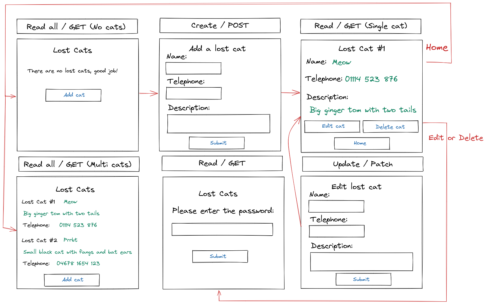

# {{PROBLEM}} Web Design Recipe (Level Two)

## 1. Describe the Problem

> As a user
* So that I can find my cat that I lost
* I want to post an advert for a lost cat with some description of the cat, and my telephone number so people can contact me
* Create / POST

> As a user
* So that I can help others find their lost cats
* I want to see all of the lost cat adverts
* Read / GET

> As a user
* So that I can update lost cat adverts with potential sightings
* I want to update adverts
* Update / PATCH


> As a user
* So that I can focus on the yet not-found cats
* I want to delete adverts for cats that have been found
* Delete / Delete

> As a user
* So that I can protect my cat adverts from weird people
* I want to give a password with each advert, and only people who give the right password can update or delete that advert
* Checks passwd field matches the one CREATED in POST action 

## 2. Design the Interface

_This is the fun part! Use excalidraw.com or a similar tool to design some
wireframes (rough sketches of the user interface). Include interactions and
transitions between pages — those are the most critical part._



## 3. Design the Data Model Classes

_These classes should store and manage the data the server will hold._
_Include the initializer and public methods with all parameters and return values._

```ruby
# EXAMPLE

class NoticeBoard
  def initialize
  end

  def report
    # Returns a list of all Cat instances
  end

  def add(cat) # cat is an instance of Cat
    # No return value
  end

  def get(index) # index is a number
    # Returns an a specific Cat instance at the given index
  def

  def update(index, updated_cat) # index is a number, udapted_cat is an existing Cat instance
    # Updates the entry at index to be the updated_cat
    # No return value
  end

  def remove(index) # index is a number
    # Deletes the entry at index
  end
end

class Cat
  def initialize(name, phone, description )
    # name is a string
    # phone is a string
    # description is a string
  end

  def name
    # Returns the title
  end

  def phone
    # returns the phone number
  end

  def description
    # Returns the description
  end
end
```

_Check them against these rules:_

> 1. Does they represent a collection or collections of data?
> 2. Does each collection have relevant methods to:
>    1. List out all items in the resource
>    2. Create an item (C)
>    3. Get a single item (R)
>    4. Update an item (U)
>    5. Delete an item (D)
> 3. Is it possible to construct a realistic data model just by using simple
>    data types? (strings, integers, booleans)
> 
> This is OK:
> ```ruby
> diary = Diary.new
> entry = DiaryEntry.new("Title", "Contents")
> diary.add(entry)
> # Ultimately only two strings enter the data model.
> ```
> 
> This is not:
> ```ruby
> diary = Diary.new
> entry = DiaryEntry.new("Title", ["Comment One", "Comment Two"])
> diary.add(entry)
> # In this case, a string and a list of strings enter the data model.
> # A list isn't a simple enough data type.
> ```
> 
> The reason for this is that we will be moving onto databases. Databases
> typically can only store simple data types, so we're keeping that discipline
> for now!
> 
> Some of these rules will be relaxed later but will keep you safe for now.

## 4. Design the Web API (Requests)

_Design requests that perform each of the key operations on your data model._
_Map them to the methods or code snippets in your data model._

```ruby
# EXAMPLE

# INDEX
# Request: GET /lostcats
board.report

# CREATE
# POST /lostcats
# With data: { name: "kitty" phone: "01243 234 853" description: "Smol kitteh" }
kitty = Cat.new(name, phone, description)
board.add(kitty)

# READ
# GET /lostcats/:index
board.get(index)

# UPDATE
# PATCH /lostcats/:index
# With data: { name: "Catter" phone: "054987 234 853" description: "Massive kitteh" }
catter = Cat.new(name, phone, description)
board.update(index, kitty)

# DELETE
# DELETE /lostcats/:index
board.remove(index)
```

> Remember:
> GET: Getting a single item or a list of items
> POST: Adding an item
> PATCH: Updating an item
> DELETE: Deleting an item

## 5. Create Examples of User Interactions

_Create examples of user interactions and expectations._

```ruby
# As you learn the testing tools you might start writing with realistic test
# code here, but at the start it's OK if it's just English or made up code.

# View no entries
visit "/lostcats"
# User sees: You have no diary entries.

# Add an entry
visit "/lostcats"
click link "Add cat"
enter "kitty" into "Name" field
enter "01243 234 853" into "Phone" field
enter "Smol kitteh" into "Description" field
click button "Submit"
# User sees in the diary list:
# Kitty
# 01243 234 853
# Smol kitteh

# Multiple entries
visit "/lostcats"
visit "/lostcats"
click link "Add cat"
enter "kitty" into "Name" field
enter "01243 234 853" into "Phone" field
enter "Smol kitteh" into "Description" field
click button "Submit"
visit "/lostcats"
click link "Add cat"
enter "catter" into "Name" field
enter "03214 984 684" into "Phone" field
enter "Massive kitteh" into "Description" field
click button "Submit"
# User sees in the diary list:
# A bad day
# I had a very bad day.
# A beautiful day
# I had a very nice day it's true.
```

## 6. Test-Drive the Behaviour

_Follow this cycle:_

1. Add a feature test in `/spec/feature/` (RED)
2. Implement the behaviour in `app.rb`
3. Does it pass without data model changes? (GREEN) Then skip to step 6.
4. Otherwise, add a unit test for the data model to `/spec/unit` (RED)
5. Implement the behaviour in your data model class. (GREEN)
6. Apply any refactors to improve the structure of the code. (REFACTOR)  
   Run `rubocop` as part of this.
7. Go back to step 1.


<!-- BEGIN GENERATED SECTION DO NOT EDIT -->

---

**How was this resource?**  
[😫](https://airtable.com/shrUJ3t7KLMqVRFKR?prefill_Repository=makersacademy/web-starter-level-two&prefill_File=recipe/recipe.md&prefill_Sentiment=😫) [😕](https://airtable.com/shrUJ3t7KLMqVRFKR?prefill_Repository=makersacademy/web-starter-level-two&prefill_File=recipe/recipe.md&prefill_Sentiment=😕) [😐](https://airtable.com/shrUJ3t7KLMqVRFKR?prefill_Repository=makersacademy/web-starter-level-two&prefill_File=recipe/recipe.md&prefill_Sentiment=😐) [🙂](https://airtable.com/shrUJ3t7KLMqVRFKR?prefill_Repository=makersacademy/web-starter-level-two&prefill_File=recipe/recipe.md&prefill_Sentiment=🙂) [😀](https://airtable.com/shrUJ3t7KLMqVRFKR?prefill_Repository=makersacademy/web-starter-level-two&prefill_File=recipe/recipe.md&prefill_Sentiment=😀)  
Click an emoji to tell us.

<!-- END GENERATED SECTION DO NOT EDIT -->
